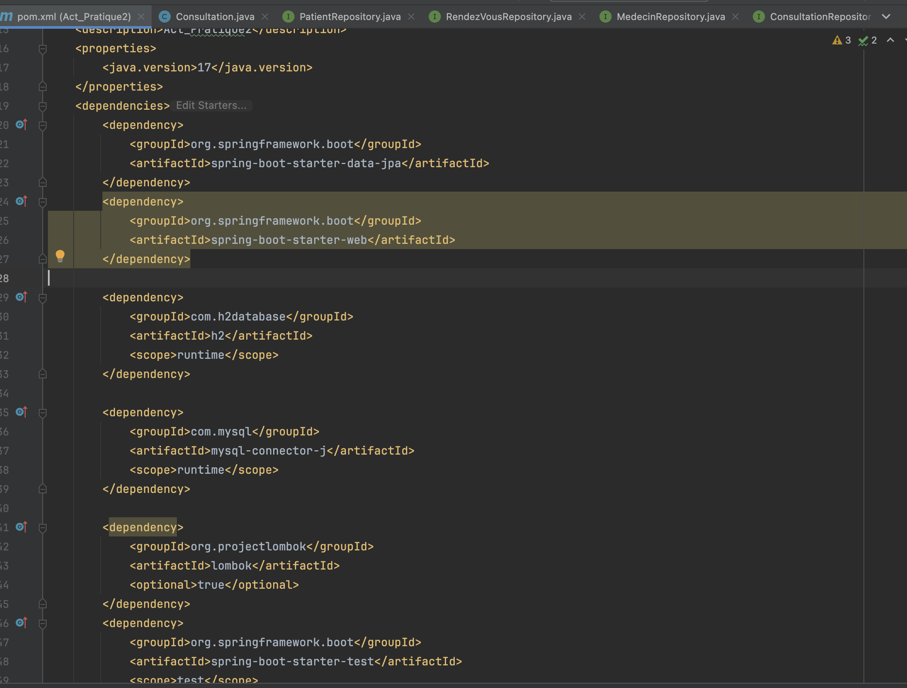
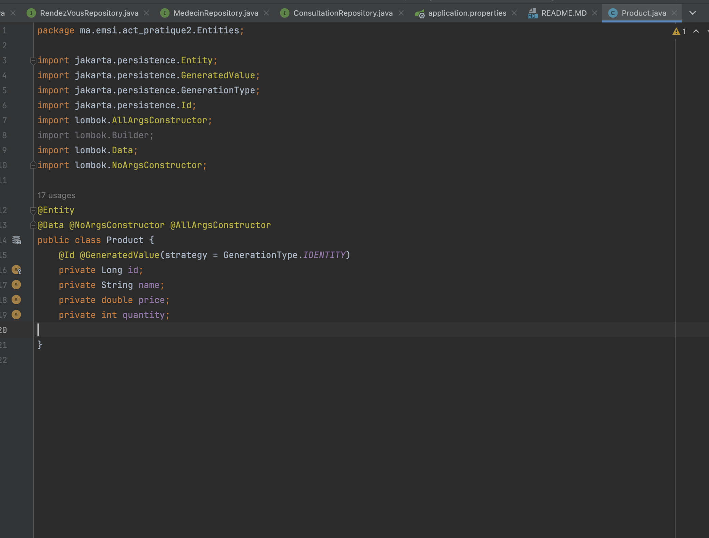
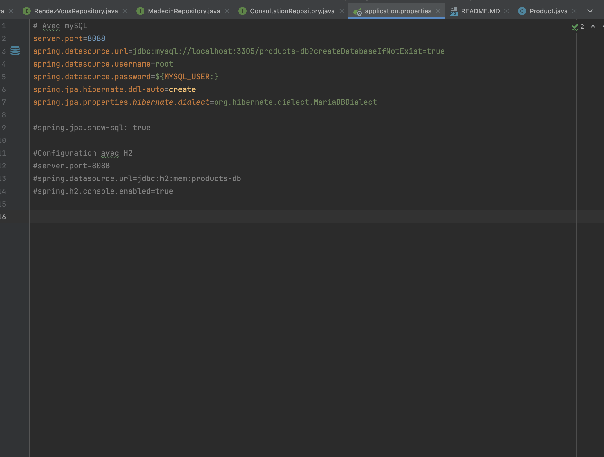

<h2>ORM JPA HIbernate Spring Data </h2>
<h3> 1.Projet Spring Initializer Cree avec les dependances demandees </h3>
<h4> - pom.xml : </h4>

<h3>l'entité JPA Product ayant les attributs 
- id de type Long
- name de type String
- price de type double
- quantity de type int </h3>

<h3>Configuration de l'unité de persistance dans le ficher application.properties  </h3>

